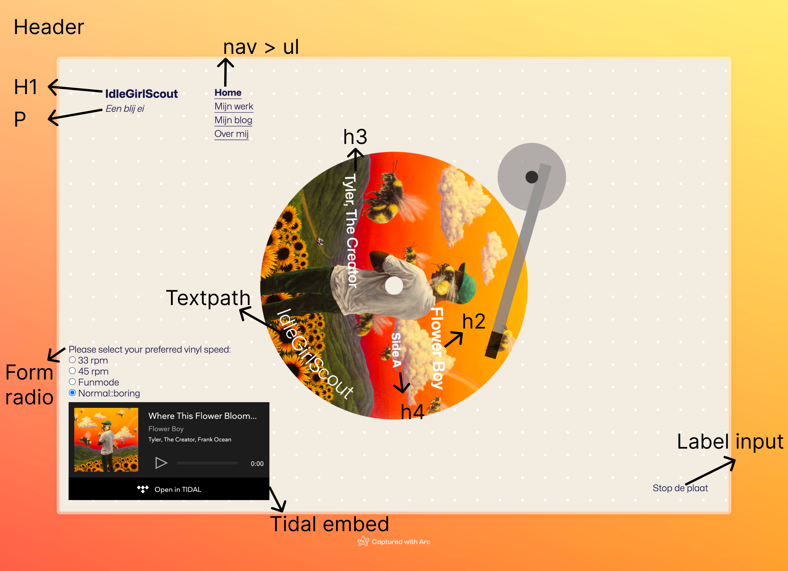

# Web App From Scratch @cmda-minor-web 2023 - 2024

In dit vak gaan we een web applicatie bouwen en leren hoe deze werken door zo min mogelijk libraries, frameworks of
andere bronnen te importen (vanilla) en zoveel mogelijk het browser platform te gebruiken door middel van HTML, CSS &
JavaScript.    
Het eindresultaat is een modulaire, single page web app (SPA), beoordeeld op jouw niveau en eigen leerdoelen.    
De bedoeling is om een web app te bouwen die data ophaalt van een externe API, deze manipuleert om te tonen in de UI van
de App, hoe abstract dan ook.
Je gaat bekende patterns leren toe passen bij het bouwen en testen van de applicatie voor een eigen "WebSite" en een
gezamenlijke "Team App".
Nog nooit heb je zo snel kunnen prototypen als nadat je hebt leren werken met de browser en haar talen.
Daarnaast zal je tijdloze kennis opdoen over het de aard en het gebruik van data, datastructuren, algoritmes, libraries,
frameworks en de werking van het web.

## Assignment
1. Bouw je eigen SPA/WebSite met externe data van een API, minimaal 1 micro interactie.
2. Een TeamApp met een verzameling van alle losse websites van je teamleden

---

## Program

| Planning | Maandag               | Dinsdag                | Woensdag                           | Donderdag                   | Vrijdag                                   |
|----------|-----------------------|------------------------|------------------------------------|-----------------------------|-------------------------------------------|
|          | Kick-Off, Dev WebSite | Dev TeamApp, Workshops | Dev *, Weekly nerd                 | Dev *, Workshops            | Code review, Voortgangsgesprekken, Dev *  |
|          | Dev *, Workshops      | College + Workshops    | Dev *, Weekly nerd, Deadline 23:59 | Mondeling, Weekly Nerd Blog | Reparatiegesprekken, Afsluiting, 🍻 Fest? |

## Rubric

Je inzet wordt beoordeeld met behulp van de rubric (zie hieronder). Je moet het criterium (middenkolom) behalen om het
vak te voltooien.
Tijdens de toets wordt je mondeling overhoord en krijg je feedback over dingen die we denken dat tekort schieten en dingen die
we denken dat een verbetering zijn op het criterium.

TBA

[//]: # ()
[//]: # (| Deficiency | Criterion                                                                                                                                                                              | Improvement |)

[//]: # (|:-----------|:---------------------------------------------------------------------------------------------------------------------------------------------------------------------------------------|:------------|)

[//]: # (|            | *User Interface* - you design, build and test the user interface by applying interface design principles                                                                               |             |)

[//]: # (|            | *Code structure* - you write modular, consistent and efficient HTML, CSS and JavaScript code by applying structure and best practices. You manage state for the application and the UI |             |)

[//]: # (|            | *Data management* - you understand how you can work with an external API using asynchronous code. You can retrieve data, manipulate and dynamically convert it to structured html      |             |)

[//]: # (|            | *Project* - your app is working and published on GitHub Pages. Your project is thoroughly documented in the `README.md` file in your repository.                                       |             |)

## docu
### breackdown schets



### uitleg code


``` javascript
fetch(`https://openapi.tidal.com/albums/${tidalID}?countryCode=US`, {
method: 'GET',
headers: {
'accept': 'application/vnd.tidal.v1+json',
'Authorization': `Bearer ${accessToken}`,
'Content-Type': 'application/vnd.tidal.v1+json'
}
})
.then(response => {
if (!response.ok) {
throw new Error(`HTTP error! Status: ${response.status}`);
}
return response.json();
})
.then(data => {
// console.log(data);
tidalInfo = data.resource;
// console.log(tidalInfo);
tidalInfo?.artists.forEach(artist => {
tidalArtist = artist;
})})
.catch(error => {
console.error('Error:', error.response ? error.response.data : error.message);
})
```


#### Fetch voor TIDAL Album Informatie
Deze fetch-functie haalt gegevens op over een specifiek album van TIDAL. Het maakt gebruik van de TIDAL Open API en vereist een geldige toegangstoken voor authenticatie. Door een verzoek te sturen naar het juiste eindpunt met het album-ID, krijgen we details zoals de titel, artiest(en) en andere metadata van het album terug als een JSON-respons. Deze informatie wordt vervolgens gebruikt om de gebruiker op de hoogte te stellen van essentiële albumgegevens.


#### Fetch voor TIDAL Album Tracks
Daarna gebruik ik die tidal ID om de tracks van het album op te halen
```javascript

fetch(`https://openapi.tidal.com/albums/${tidalID}/items?countryCode=US&offset=0`, {
    method: 'GET',
    headers: {
        'accept': 'application/vnd.tidal.v1+json',
        'Authorization': `Bearer ${accessToken}`,
        'Content-Type': 'application/vnd.tidal.v1+json'
    }
})
    .then(response => {
        if (!response.ok) {
            throw new Error(`HTTP error! Status: ${response.status}`);
        }
        return response.json();
    })
    .then(data => {
        // console.log(data);
        tidalAlbum = data;
        // console.log(tidalAlbum.data[1].id);
    })
    .catch(error => {
        console.error('Error:', error.message);
    });
```
Deze fetch-functie is verantwoordelijk voor het ophalen van de lijst met tracks van een specifiek album van TIDAL. Het werkt op een vergelijkbare manier als de fetch-functie voor albuminformatie, maar richt zich specifiek op het verzamelen van trackgegevens. Het resultaat is een JSON-object met details zoals de tracknaam, duur en volgorde binnen het album. Deze informatie is belangrijk om de gebruiker een volledig beeld te geven van wat ze kunnen verwachten bij het beluisteren van het album.

Deze fetch-functies zijn essentieel voor het dynamisch ophalen van gegevens van TIDAL's servers en vormen de basis voor het presenteren van relevante informatie aan gebruikers op een webpagina.


#### API call client side
```javascript
async function fetchDataAndRender() {
    try {
        const response = await fetch('./docs/data/eigenschappen.json');
        const data1 = await response.json();
        const data = data1.eend;
        const eend = data.favorieteDoelwit;
        console.log(eend);

        // Get reference to the <main> element
        const mainElement = document.querySelector('main');

        // Create a <div> element
        const divElement = document.createElement('div');

        // Create a <ul> element
        const ulElement = document.createElement('ul');

        // Iterate through the data and create <li> elements
        for (const key in data) {
            if (Object.hasOwnProperty.call(data, key)) {
                if (key === 'favorieteDoelwit') { // oi dit werkt niet, kan aan gewerkt worden
                    console.log("test")
                    const liElement = document.createElement('li');
                    liElement.textContent = `${key}: ${eend}`;
                    ulElement.appendChild(liElement);
                    continue;
                }
                else {
                    const liElement = document.createElement('li');
                    liElement.textContent = `${key}: ${data[key]}`;
                    ulElement.appendChild(liElement);
                }
            }
        }

        // Append the <ul> element to the <div> element
        divElement.appendChild(ulElement);

        // Append the <div> element to the <main> element
        mainElement.appendChild(divElement);
    } catch (error) {
        console.error("Error:", error);
    }
}

fetchDataAndRender();
```
Hier heb ik de eigenschappen.json gefetch en die in de main gezet. Daarbij heb ik gebruik gemaakt van een for loop en zo de data in een UL gedropt. Ik heb alleen wat issues gehad met het favoriete doelwit, die wilt gek genoeg nu niks laten zien. Terwijl ik die wel goed uit de console log krijg, daar zou ik later nog een keer naar moeten kijken.


<!-- Add a link to your live demo in Github Pages 🌐-->
https://wafs-kaori1.onrender.com/

<!-- ☝️ replace this description with a description of your own work -->
Ik heb een applicatie/portfolio gemaakt door gebruik te maken van de Tidal Api in een EJS|Express Node framework//server

<!-- replace the code in the /public folder with your own, so you can showcase your work with GitHub Pages 🌍 -->


<!-- Maybe a table of contents here? 📚 -->

<!-- How about a section that describes how to install this project? 🤓 -->
Typ `node install` in de terminal

Of gebruikt `node --version` om te checken of je node al hebt geinstalleerd op je computer

### GIT
**Installeer GIT**
Typ `git install` in je terminal

Of gebruik `git --version` om te checken of je GIT al hebt geinstalleerd op je computer

***


**Clone repository**

`git clone https://github.com/KaoriYes/studs`

**Installeer NPM**

`npm install`

**Start Node.js**

`npm start`


<!-- ...but how does one use this project? What are its features 🤔 -->

Het is niet echt een project dat je kan gebruiken, maar het is wel een leuk voorbeeld om van de te spieken als je ooit een vinyl site moet maken

<!-- What external data source is featured in your project and what are its properties 🌠 -->
Mijn voornaamste data source is de Tidal API 
(https://developer.tidal.com/apiref?spec=catalogue)

<!-- Maybe a checklist of done stuff and stuff still on your wishlist? ✅ -->
Ik zou graag nog een darkmode toevoegen, hier had ik spijtig genoeg geen tijd voor. Ook zou ik op de duur een automatische acces code aanvrager willen maken
Waar ik echt moeite mee had, was om het album bij elke refresh te restarten. Dat is nietg elukt omdat ik het niet voor elkaar kreeg om bij refresh een nieuwe request te sturen, hij bleef hangen op de vorige request.
<!-- How about a license here? 📜 (or is it a licence?) 🤷 -->
